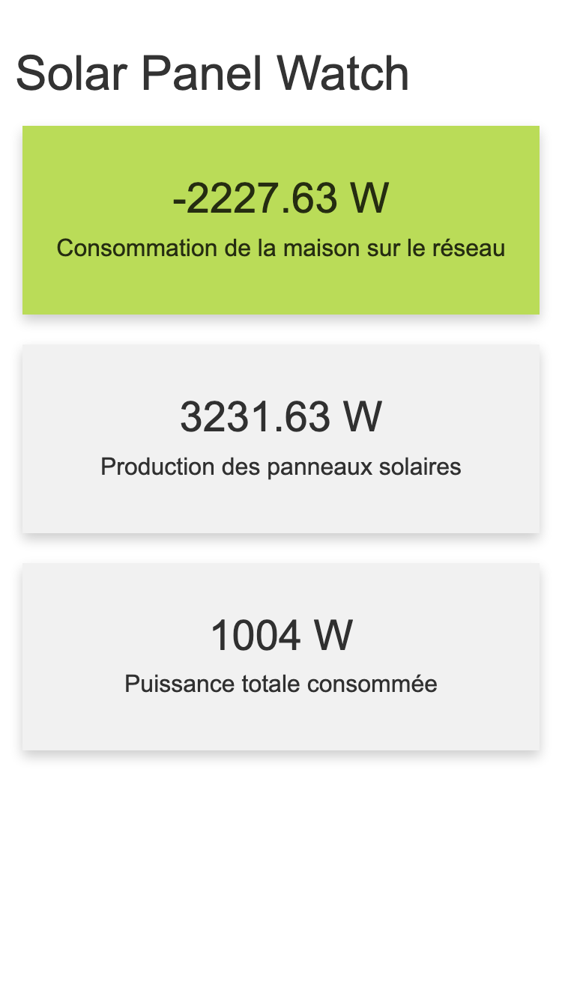

# solar-panel-watch
Watch over electricity consumption from my house.



## config.json

```json
{
    "ip_adress_shelly": "192.168.0.91",
    "influx_tocken": "tocken",
    "influx_org": "cedced19@gmail.com",
    "influx_bucket": "solar-panel",
    "influx_default_tag": "home1",
    "influx_update_delay": 15000,
    "influx_url": "https://**********.influxdata.com",
    "timezone": "Europe/Paris",
    "shelly_req_threshold": 3000,
    "energy_req_threshold": 1200000,
    "force_mode_pass": "7HaIJtG44d"
}
```

## devices-to-activate.json
```json
[
    {
        "uri": "water-heater",
        "power_limit": 400,
        "time_limit": 30000,
        "power_threshold_percentage": 0.05,
        "ids": ["Q7qR9"],
        "priority": 1
    },
    {
        "uri": "heat-pump",
        "power_limit": 1000,
        "time_limit": 35000,
        "power_threshold_percentage": 0.10,
        "ids": ["8yaPTC"],
        "priority": 2
    }
]
```

## docker

```
sudo docker compose up
sudo docker compose -f docker-compose-npm-install.yml up
```

to remove volume:
```
sudo docker volume rm solar-panel-watch_data
```

## TODO

* Add documentation on config files
* Add testing bots for devices
* Add local influx in docker compose
* Add a night mode in order to prevent calculation and communications during night
* Add a UI to configure the system
* Improve the debug system to adapt the period of request to the value
* Add threshold on disconnection of devices